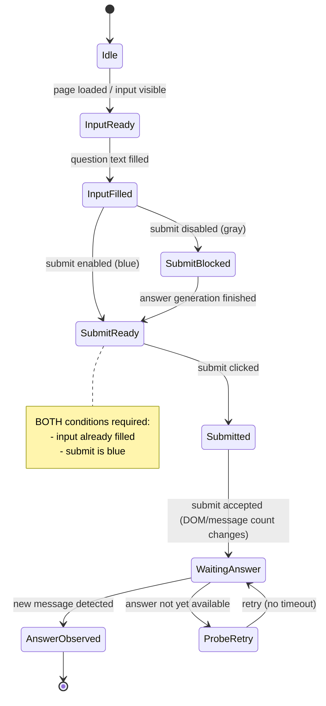

# Decision Record: Submit State Machine（正本）

## 1. 背景・問題認識

F10-A 実行および markdown 版全件実行において、以下の不安定挙動が確認された。

- 1問目は正常に実行されるが、2問目以降で停止・フリーズする
- submit ボタンは blue（有効）になるが、質問が投入されていない
- submit_diagnostics.json では ui_ack=true が記録されている
- 無制限待ちを導入すると、処理が進行せず停止する

これらの事象から、

- submit（送信）ロジックそのものではなく
- **「質問投入（input）」と「submit 実行」の状態管理が崩れている**

可能性が高いと判断した。

本 Decision Record では、  
**input → submit → answer** の正しい状態遷移（state machine）を正本として確定する。

---

## 2. Submit State Machine（正本）

以下を本プロジェクトにおける **Submit State Machine の正本定義**とする。



---

## 3. 重要な設計判断（確定事項）

### 3.1 SubmitReady の成立条件

`SubmitReady` 状態は、以下 **両方が成立した場合のみ**成立する。

- 質問テキストが input に投入されている（InputFilled）
- submit ボタンが enabled / blue である

**submit が blue であること単独では不十分**とする。

---

### 3.2 ui_ack の意味範囲

`submit_diagnostics.json` に記録される `ui_ack=true` は、

- UI レベルで submit 操作（click / requestSubmit）が受理された

ことのみを示す。

以下は **保証しない**。

- 入力内容が存在したか
- 正しい質問が送信されたか
- 新しい message が生成されるか

従って、

> ui_ack=true ≠ 正しい submit 成立

である。

---

### 3.3 無制限待ちがフリーズを引き起こす理由

無制限待ち自体が問題ではない。
以下の不正遷移が起きると、無制限待ちは停止状態を固定化する。

```text
Idle / InputReady
  ↓
SubmitReady（input 未投入）
  ↓
（submit click 不発）
  ↓
WaitingAnswer に入らない
```

本 Decision Record は、この不正遷移を **設計上禁止**する。

---

## 4. chat_page.py の責務との対応付け

| State         | chat_page.py の責務                 |
| ------------- | -------------------------------- |
| InputReady    | MESSAGE_INPUT が visible であることを保証 |
| InputFilled   | input_box.fill(message) を実行      |
| SubmitReady   | submit の状態（blue/gray）を観測         |
| Submitted     | click / requestSubmit を実行        |
| WaitingAnswer | **責務外（run_single_question.py）**  |

**submit の観測と input 投入は同一関数に存在しても、状態は分離して扱う必要がある。**

---

## 5. 現行実装との差分認識

現行実装では、以下の誤認が起きうる。

- submit が blue になったことをもって「次の質問が投入された」と誤解する
- DOM 再生成後に input locator が stale になり、fill が実質的に失敗する
- InputFilled が成立しないまま submit 監視に進む

これらは本 State Machine に照らすと **設計違反**である。

---

## 6. 結論（固定）

- 本 Mermaid 図を Submit State Machine の正本とする
- submit の成否判定は **input 状態を含めて判断**する
- 無制限待ちは本 State Machine を満たす場合にのみ有効である

---

## 7. 今後のアクション（非拘束）

- chat_page.submit() 実装を本 State Machine に照らしてレビュー
- InputFilled 成立の検証（value assertion 等）の導入検討
- submit_diagnostics.json への state 遷移情報の追記検討

---

以上。
